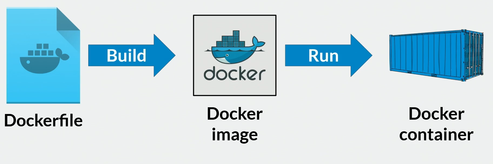

# 📦 Curso Docker

Este repositorio contiene una guía práctica para aprender los **conceptos básicos de Docker**, incluyendo comandos esenciales, construcción de imágenes, ejecución de contenedores y gestión de recursos.

---

## 📑 Índice

- [🚀 Comandos básicos](#-comandos-básicos)
- [🔍 Exploración de comandos](#-exploración-de-comandos)
- [📂 Flujo de trabajo](#-flujo-de-trabajo)
- [🛠️ Construcción de imágenes con Dockerfile](#️-construcción-de-imágenes-con-dockerfile)
    - [1. Crear la imagen](#1-crear-la-imagen)
    - [2. Construir con nombre y tag](#2-construir-con-nombre-y-tag)
- [🖥️ Construcción y ejecución de contenedores](#️-construcción-y-ejecución-de-contenedores)
- [🗂️ Gestión de imágenes](#️-gestión-de-imágenes)
- [🛠️ Gestión de contenedores](#️-gestión-de-contenedores)
    - [Ejecutar múltiples contenedores](#ejecutar-múltiples-contenedores-de-la-misma-imagen)
    - [Listar todos los contenedores](#listar-todos-los-contenedores-incluidos-detenidos)
    - [Ver tamaño de los contenedores](#ver-tamaño-de-los-contenedores)
    - [Detener un contenedor](#detener-un-contenedor)
    - [Monitorear recursos](#monitorear-recursos-de-los-contenedores)
- [✅ Conclusión](#-conclusión)

---

## 🚀 Comandos básicos

Verificar la versión instalada:
```bash
docker -v
```

Ver información general del sistema Docker:
```bash
docker info
```

Listar imágenes disponibles:
```bash
docker images
```

Listar contenedores en ejecución:
```bash
docker ps
```

---

## 🔍 Exploración de comandos

Para obtener ayuda sobre un comando específico:
```bash
docker <comando> --help
```

Ejemplo:
```bash
docker images --help
docker ps --help
```

---

## 📂 Flujo de trabajo



---

## 🛠️ Construcción de imágenes con Dockerfile

### 1. Crear la imagen
Si el `Dockerfile` está en el mismo directorio, utilizamos:
```bash
docker build .
```

Esto genera una imagen **sin nombre ni tag**, lo cual no es recomendable.  
Ejemplo:
```
REPOSITORY   TAG       IMAGE ID       CREATED         SIZE
<none>       <none>    13e33a3c9fb2   90 minutes ago   279MB
```

Para eliminar esa imagen anónima:
```bash
docker rmi -f <IMAGE ID>
```

---

### 2. Construir con nombre y tag
Para asignar un nombre y versión a la imagen:
```bash
docker build -t sitioweb:latest .
```

Ejemplo:
```
REPOSITORY   TAG       IMAGE ID       CREATED         SIZE
sitioweb     latest    2d0934cdba2b   9 minutes ago   279MB
```

Ahora la imagen tiene un **nombre (repository)** y un **tag (versión)** claros.

---

## 🖥️ Construcción y ejecución de contenedores

Ejecutar un contenedor a partir de la imagen:
```bash
docker run -it --rm -d -p 8080:80 --name web sitioweb
```

**Parámetros importantes:**
- `-it` → modo interactivo (permite ver logs).
- `--rm` → elimina el contenedor cuando se detiene.
- `-d` → ejecuta en segundo plano.
- `-p 8080:80` → expone el puerto 80 del contenedor en el puerto 8080 del host.
- `--name web` → asigna un nombre al contenedor.
- `sitioweb` → nombre de la imagen.

### Detener o eliminar contenedores
Detener un contenedor:
```bash
docker stop <CONTAINER ID>
```

Eliminar un contenedor forzado:
```bash
docker rm -f <CONTAINER ID>
```

---

## 🗂️ Gestión de imágenes

Ver una imagen específica:
```bash
docker images <nombre-imagen>
```

Filtrar imágenes por versión (ejemplo: `1.0`):
```bash
docker images --filter=reference='*:1.0'
```

### Crear un nuevo tag para una imagen existente
```bash
docker image tag sitioweb:latest usuario/sitioweb:latest
```

### Eliminar una etiqueta de imagen
```bash
docker rmi <tag>
```

### Eliminar una imagen
> ⚠️ Nota: no puedes eliminar una imagen si está siendo utilizada por un contenedor.
```bash
docker rmi <IMAGE ID>
```

---

## 🛠️ Gestión de contenedores

### Ejecutar múltiples contenedores de la misma imagen
Para ejecutar 2 contenedores a partir de la **misma imagen**, se debe usar un puerto distinto y un nombre diferente:

Primer contenedor:
```bash
docker run -it --rm -d -p 8080:80 --name web sitioweb
```

Segundo contenedor:
```bash
docker run -it --rm -d -p 8085:80 --name web85 sitioweb
```

> ⚠️ No pueden existir **dos contenedores con el mismo nombre** ejecutándose al mismo tiempo.

---

### Listar todos los contenedores (incluidos detenidos)
```bash
docker ps -a
```

### Ver tamaño de los contenedores
```bash
docker ps --size
```

El tamaño que aparece entre paréntesis es el **espacio que ocupa cada vez que el contenedor se ejecuta**.  
Ejemplo:
```
81.9kB (virtual 207MB)
```

---

### Detener un contenedor
Esto también lo elimina de **Docker Desktop**:
```bash
docker stop <CONTAINER ID>
```

---

### Monitorear recursos de los contenedores
```bash
docker stats
```

Este comando muestra el uso de CPU, memoria, red y disco en tiempo real.

---

## ✅ Conclusión
Con estos comandos básicos puedes:
- Crear imágenes personalizadas.
- Ejecutar y administrar contenedores.
- Gestionar recursos y optimizar el uso de Docker.

---
